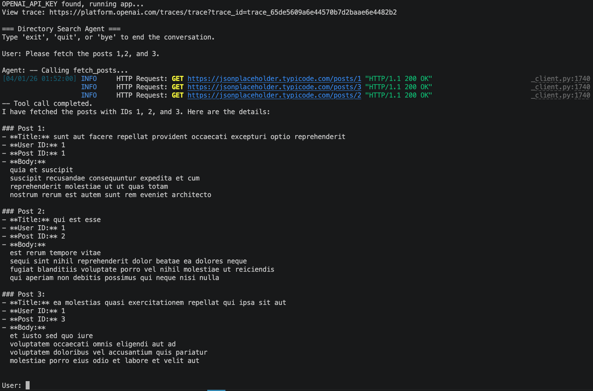
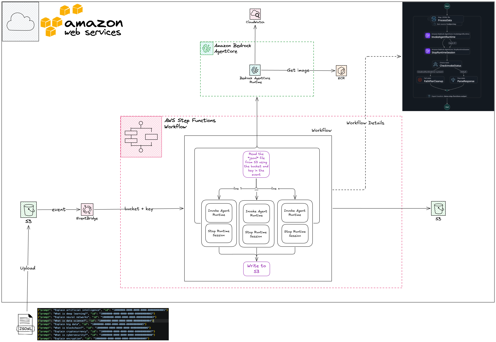
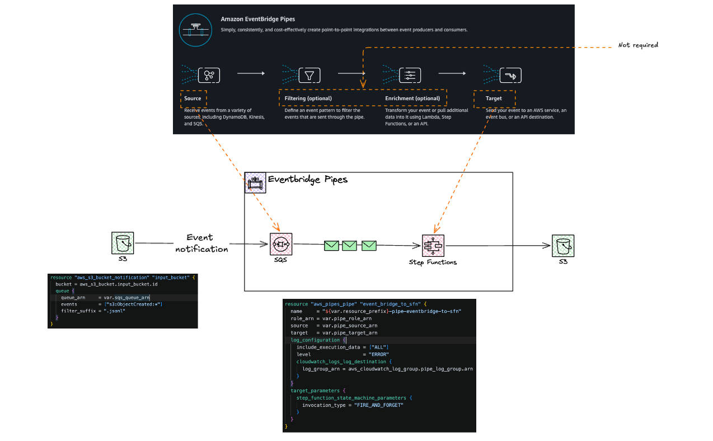
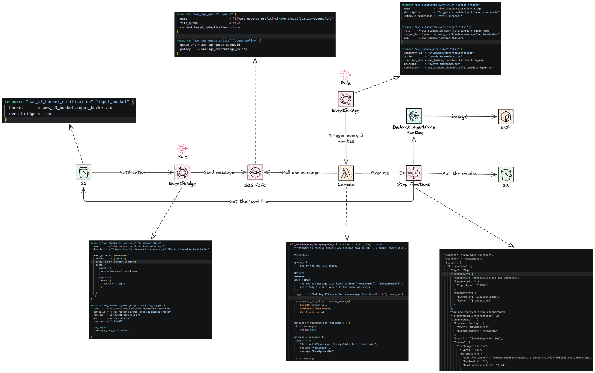
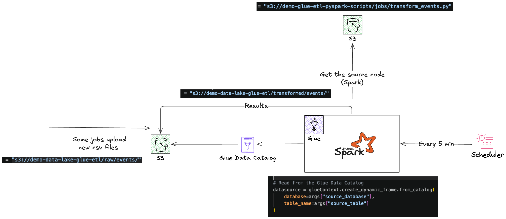
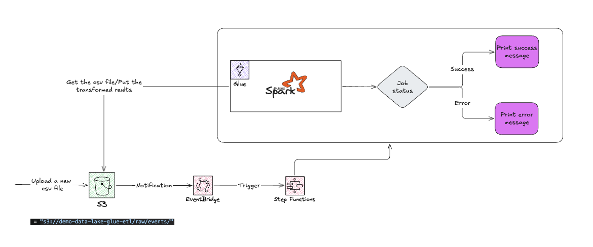

## Example conversations

### Reading a file from S3

### Fetching multiple posts from an external API

## Connecting/Adding the MCP server to your Claude Desktop APP

Use `claude_desktop_config.json` for this purpose. 

## Integration of AWS step functions with AWS Bedrock AgentCore Runtime

I have created a Bedrock AgentCore runtime in `search_agent.ipynb` (Bedrock AgentCore app `aws_bedrock_agentcore/dummy_agent.py` contains the implementation of a Bedrock AgentCore runtime which has been containerized and used to create the runtime).    

Here, the idea is to invoke the runtime using an AWS step function when a `jsonl` file is uploaded into a S3 bucket. The resources to create a step function are located in `tf` directory.

### Using Eventbrige to invoke the step function

#### Version 1

#### Version 2

#### version 3

### Glue job (Spark)

#### Version 1

#### Version 2

